# aws-vpc-architecture
# Multi-Tier VPC Architecture

> Status: ✅ Complete

## Overview
This project is a multi-tier network architecture on AWS, built to demonstrate deep-networking skills that a serverless project doesn't touch — public/private subnet design, secure routing, load balancing, and auto-scaling.

An Application Load Balancer sits in public subnets and receives internet traffic, forwarding it to a group of EC2 instances running in private subnets with no direct internet exposure. An Auto Scaling Group manages instance count based on load, and AWS Systems Manager (SSM) Session Manager provides secure access to the private instances without opening SSH ports to the internet.

Beyond the working architecture, this project is a hands-on exploration of VPC/subnet design, NAT gateways, security groups vs. NACLs, load balancing, and auto-scaling — including real issues encountered and resolved along the way.

## Architecture


Internet traffic enters through the Internet Gateway into the public subnets, where the Application Load Balancer distributes it to EC2 instances in the private subnets via a target group. The Auto Scaling Group manages instance count based on CPU load, while a NAT Gateway provides outbound-only internet access for the private instances. VPC Flow Logs, CloudWatch alarms, and SNS notifications provide visibility across the whole architecture.

## Infrastructure as Code
The entire architecture is defined in `infrastructure/template.yaml` and deployed via:
`aws cloudformation deploy --template-file infrastructure/template.yaml --stack-name vpc-architecture-stack --capabilities CAPABILITY_NAMED_IAM`

## AWS Services Used
| Service | Purpose |
|---|---|
| VPC | Custom-CIDR (10.0.0.0/16) isolated network for this project |
| Subnets | 2 public (10.0.0.0/24, 10.0.1.0/24) + 2 private (10.0.10.0/24, 10.0.11.0/24), spread across ap-south-1a and ap-south-1b for AZ redundancy |
| Internet Gateway | Attached to the VPC; provides the internet route used by public subnets |
| Route Tables | public-route-table (0.0.0.0/0 → IGW, associated with public subnets); private-route-table (local-only, no internet route, associated with private subnets) |
| NAT Gateway | Provides outbound-only internet access for private subnets, sitting in a public subnet; paired with an Elastic IP |
| Security Groups | alb-sg (allows inbound HTTP from internet); ec2-sg (allows inbound HTTP only from alb-sg) |
| IAM Role | ec2-ssm-role — grants EC2 instances permission to be managed via SSM Session Manager |
| Launch Template | Blueprint for EC2 instances — Amazon Linux 2023, t2.micro/t3.micro, ec2-sg, ec2-ssm-role, user data installs Apache |
| Auto Scaling Group | vpc-architecture-asg — spans both private subnets, desired 1 / min 1 / max 2 |
| Target Group | vpc-architecture-tg — HTTP:80, health check path `/`, registered EC2 targets from the ASG |
| Application Load Balancer | vpc-architecture-alb — internet-facing, spans both public subnets, alb-sg attached, HTTP:80 listener forwarding to the target group |
| Auto Scaling Policy | Target tracking on Average CPU Utilization, target 50% — automatically scales the ASG based on real load instead of a fixed capacity |
| CloudWatch Alarms | alb-5xx-alarm (custom, on HTTPCode_ELB_5XX_Count); AlarmHigh/AlarmLow (auto-created by the target tracking policy) |
| CloudFormation Template | infrastructure/template.yaml — defines the entire architecture (~15+ resources) as code; deployed via `aws cloudformation deploy` |
| IAM User (github-actions-deployer-vpc) | Scoped CI/CD identity used by GitHub Actions to deploy the CloudFormation stack |
| GitHub Actions | Automates `aws cloudformation deploy` on push to main, scoped to changes in infrastructure/template.yaml |
| CloudWatch Log Group | /vpc/vpc-architecture-flow-logs — 1-day retention, receives VPC Flow Log entries |
| IAM Role (vpc-flow-logs-role) | Custom-scoped policy allowing the VPC Flow Logs service to write to the specific log group |
| VPC Flow Log | vpc-architecture-flow-log — VPC-wide scope, captures ALL traffic (accept + reject) to CloudWatch Logs |

## Cost Breakdown
Every resource in this project stays within AWS's free tier. Full per-resource breakdown → [`docs/cost-breakdown.md`](./docs/cost-breakdown.md)

| Category | Services | Monthly Cost |
|---|---|---|
| Networking foundation | VPC, subnets, route tables, Internet Gateway | $0 |
| Outbound connectivity | NAT Gateway + Elastic IP | ~$0.045/hr + ~$0.045/GB processed while running; **not free-tier** — deleted between sessions to avoid ongoing charges |
| Compute | EC2 (via ASG), Launch Template, Security Groups, IAM Role | $0 while within free-tier 12-month window (750 hrs/month t2.micro/t3.micro combined); keep desired capacity low (1-2) to control hours used |
| Load balancing | Application Load Balancer, Target Group | ~$0.0225/hr (~$16/month if left running) + negligible LCU charge at test volume; **not free-tier** — delete between sessions unless moving straight into next milestone |
| Scaling & monitoring | Target tracking scaling policy, CloudWatch alarms | $0 — scaling policy is free; alarms are free tier eligible (well within the 10 free-tier alarm limit) |
| Infrastructure as Code | CloudFormation | $0 — no charge for the CloudFormation service itself; only the underlying resources it creates are billed, same as their individual costs listed above |
| CI/CD | GitHub Actions, IAM deploy user | $0 — GitHub Actions is free for this repo; IAM user has no cost |
| Network audit logging | VPC Flow Logs, CloudWatch Log Group | Negligible — CloudWatch Logs ingestion (~$0.50-0.76/GB) + storage (~$0.03/GB/month), effectively <$0.01 at test traffic volume; 1-day retention keeps storage from accumulating |

## Setup / Deployment Guide

### Prerequisites
- An AWS account
- AWS CLI installed and configured (`aws configure`) with credentials for an IAM user with sufficient permissions to create VPC, EC2, ELB, Auto Scaling, IAM, CloudWatch, SNS, and CloudFormation resources
- Git installed

### Option A: Manual deploy via AWS CLI
1. Clone this repository:
```bash
git clone https://github.com/Kashvi09/aws-vpc-architecture.git
cd aws-vpc-architecture
```

2. Deploy the CloudFormation stack:
```bash
aws cloudformation deploy \
  --template-file infrastructure/template.yaml \
  --stack-name vpc-architecture-stack \
  --capabilities CAPABILITY_NAMED_IAM
```

3. Once complete, retrieve the ALB's DNS name:
```bash
aws cloudformation describe-stacks \
  --stack-name vpc-architecture-stack \
  --query "Stacks[0].Outputs" \
  --output table
```

4. Confirm the SNS email subscription (check your inbox for a confirmation email after deployment).

### Option B: Automated deploy via CI/CD (GitHub Actions)
1. Fork or clone this repository.
2. Create an IAM user in your own AWS account with programmatic access and permissions covering VPC, EC2, ELB, Auto Scaling, IAM, CloudWatch, SNS, and CloudFormation.
3. In your forked repo, go to **Settings → Secrets and variables → Actions**, and add:
   - `AWS_ACCESS_KEY_ID`
   - `AWS_SECRET_ACCESS_KEY`
4. Push any change to `infrastructure/template.yaml` on the `main` branch — this automatically triggers `.github/workflows/deploy.yml`, which deploys the stack to your AWS account.

### Testing the deployment
1. Get the ALB DNS name from the stack Outputs (see step 3 above).
2. Open it in a browser using `http://` explicitly (the listener is HTTP-only — browsers defaulting to HTTPS will fail to connect).
3. Confirm the test page loads, showing `Hello from <hostname>`.
4. Optionally, connect via Systems Manager Session Manager to the EC2 instance to confirm SSM access works without any SSH key.

### Cleanup / Cost avoidance
To tear down every resource this project creates in one step:
```bash
aws cloudformation delete-stack --stack-name vpc-architecture-stack
```

Confirm it's fully deleted before assuming you're not being charged:
```bash
aws cloudformation describe-stacks --stack-name vpc-architecture-stack
```
This should return a "stack does not exist" error once deletion completes. Unlike Project 1, several resources here (NAT Gateway, ALB) bill hourly while running — this project is **not** meant to be left running continuously; tear down between sessions unless actively working through a milestone.

## Milestone Log

Detailed write-ups (why each decision was made, what was built, lessons learned) live in [`/docs/milestones`](./docs/milestones):

- [Milestone 1: VPC Foundation — CIDR, Subnets, Internet Gateway, Route Tables](./docs/milestones/milestone-1-vpc-foundation.md)
- [Milestone 2: NAT Gateway — Outbound Internet for Private Subnets](./docs/milestones/milestone-2-nat-gateway.md)
- [Milestone 3: EC2 + Auto Scaling Group (Private Subnets)](./docs/milestones/milestone-3-ec2-asg.md)
- [Milestone 4: Application Load Balancer](./docs/milestones/milestone-4-alb.md)
- [Milestone 5: Auto Scaling Policies + CloudWatch Monitoring](./docs/milestones/milestone-5-scaling-monitoring.md)
- [Milestone 6: CloudFormation Rewrite (Infrastructure as Code)](./docs/milestones/milestone-6-cloudformation.md)
- [Milestone 7: CI/CD via GitHub Actions](./docs/milestones/milestone-7-github-actions.md)
- [Milestone 8: VPC Flow Logs](./docs/milestones/milestone-8-vpc-flow-logs.md)

## Known Limitations
- `github-actions-deployer-vpc` uses broad managed policies (including `IAMFullAccess`) rather than scoped custom policies for exact resource ARNs.
- `ec2-ssm-role` uses the broad AWS-managed `AmazonSSMManagedInstanceCore` policy rather than a scoped custom policy.
- The ALB listener is HTTP-only — no HTTPS/TLS termination, since no custom domain was set up for this project.
- No AWS WAF attached to the ALB — the load balancer has no filtering against malicious request patterns (e.g. SQL injection, rate limiting).
- A single NAT Gateway serves both private subnets — it lives in one AZ (`ap-south-1a`), making it a single point of failure for outbound connectivity if that AZ has an outage.
- CI/CD authenticates via long-lived static AWS access keys stored as GitHub secrets, rather than short-lived OIDC-federated credentials.

## Future Improvements
- Scope `github-actions-deployer-vpc` and `ec2-ssm-role` down to exact resource ARNs, matching the least-privilege pattern already applied to the VPC Flow Logs IAM role.
- Add HTTPS via an ACM certificate and HTTPS listener on the ALB.
- Attach AWS WAF to the ALB for request-level filtering.
- Add a second NAT Gateway in `ap-south-1b` for outbound-path redundancy across both AZs.
- Migrate CI/CD authentication from static access keys to OIDC federation.

## Interview Questions & Answers
A compiled set of technical Q&A covering VPC design, NAT/ALB behavior, Auto Scaling, IaC, CI/CD, and network security decisions made throughout this project → [`docs/interview-questions.md`](./docs/interview-questions.md)