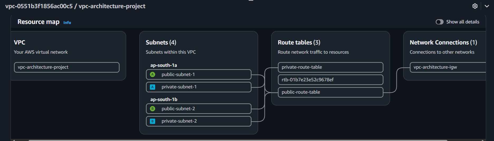

# Milestone 1: VPC Foundation — CIDR, Subnets, Internet Gateway, Route Tables

**Why:** Before building any compute or load balancing resources, the network itself needs to exist and be deliberately designed — which IP ranges to use, which subnets are internet-facing vs. isolated, and across which Availability Zones, so that the architecture has fault tolerance built in from the start rather than bolted on later.

**What was built:**
- 1 VPC — CIDR 10.0.0.0/16
- 2 public subnets — 10.0.0.0/24 (ap-south-1a), 10.0.1.0/24 (ap-south-1b)
- 2 private subnets — 10.0.10.0/24 (ap-south-1a), 10.0.11.0/24 (ap-south-1b)
- 1 Internet Gateway, attached to the VPC
- 2 route tables — public-route-table (0.0.0.0/0 → IGW, associated with public subnets) and private-route-table (local-only, no internet route, associated with private subnets)

**Lessons Learned**
- A /16 VPC wasn't just "future-proofing" — a /24 VPC (256 addresses total) genuinely couldn't fit four /24 subnets (needs at least a /22), so /16 was necessary for the current design, not just extra room to grow.
- AZ redundancy works at the tier level, not the individual subnet level — public-subnet-1 and private-subnet-1 can share an AZ without a problem, as long as each tier (public, private) has a subnet in a second AZ to fall back on.
- A route table isn't a security boundary by itself — even a misconfigured 0.0.0.0/0 → IGW route on a "private" subnet wouldn't expose an instance unless it also had a public IP and a security group allowing the traffic. Real protection comes from multiple independent layers, not one.

**Screenshots**
