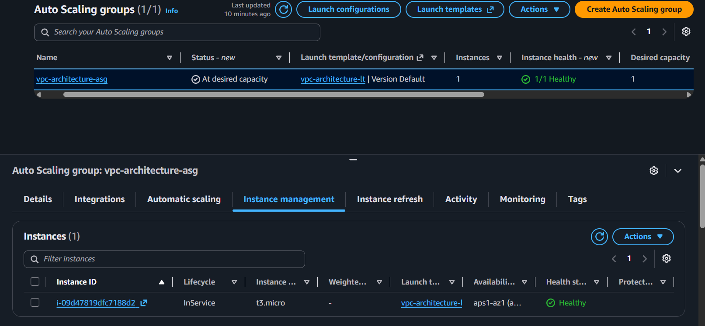
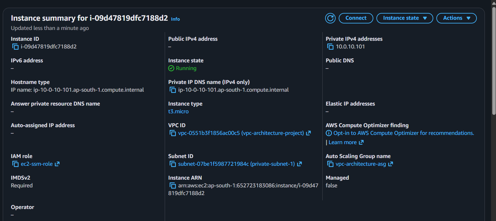
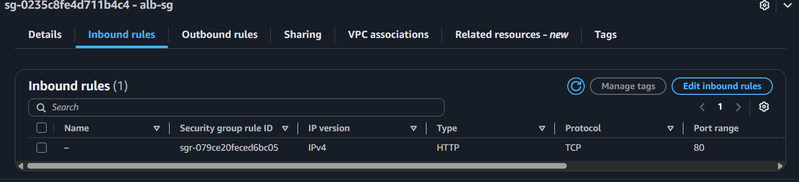
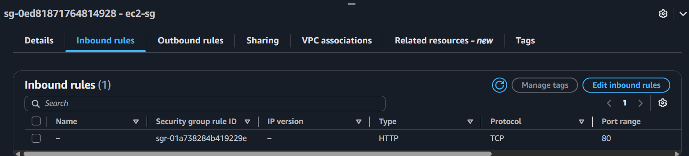
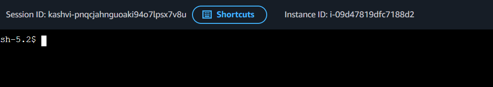

# Milestone 3: EC2 + Auto Scaling Group (Private Subnets)

**Why:** With the network foundation in place, this milestone adds the actual compute layer — the servers that will run the application. Instances are placed in private subnets with no public IP and no direct internet route, and are managed by an Auto Scaling Group rather than launched individually, so the architecture gets self-healing (unhealthy instances are replaced automatically) and can scale capacity based on demand. Two security groups enforce, at the traffic level, that only the future load balancer — not the internet directly — can reach these instances. SSM Session Manager is used for secure access instead of SSH, removing the need for any key pair or open inbound port 22.

**What was built:**
- Security group `alb-sg` — allows inbound HTTP (port 80) from `0.0.0.0/0`, for the future ALB
- Security group `ec2-sg` — allows inbound HTTP (port 80) only from `alb-sg` as the source, not from any IP range
- IAM role `ec2-ssm-role` — attached to EC2 instances, using the AWS-managed `AmazonSSMManagedInstanceCore` policy, granting permission for SSM Session Manager access
- Launch template `vpc-architecture-lt` — Amazon Linux 2023 AMI (SSM agent pre-installed), t2.micro/t3.micro, no key pair, `ec2-sg` attached, `ec2-ssm-role` as instance profile, user data script installing and starting Apache with a test HTML page
- Auto Scaling Group `vpc-architecture-asg` — spans both private subnets (private-subnet-1, private-subnet-2), desired capacity 1, minimum 1, maximum 2

**Lessons Learned**
- Selecting `alb-sg` as the *source* in `ec2-sg`'s inbound rule (rather than an IP range) means only traffic from resources carrying that security group can reach the EC2 instances — a dynamic, identity-based rule rather than a fixed IP allowlist, which holds even as the ALB's underlying IPs change.
- Using an AMI with the SSM agent pre-installed (Amazon Linux 2023) avoids a chicken-and-egg dependency: installing the SSM agent manually would require internet access, which itself depends on NAT Gateway connectivity — so if NAT were misconfigured, there'd be no way to access the instance at all, since no SSH key pair exists as a fallback.

**Screenshots**

