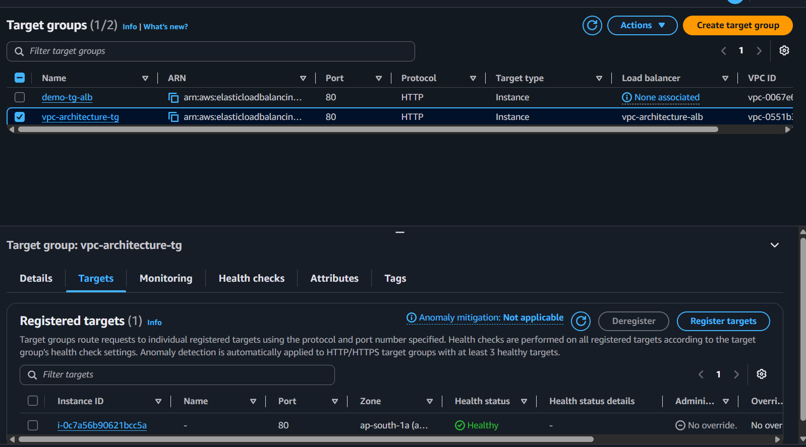
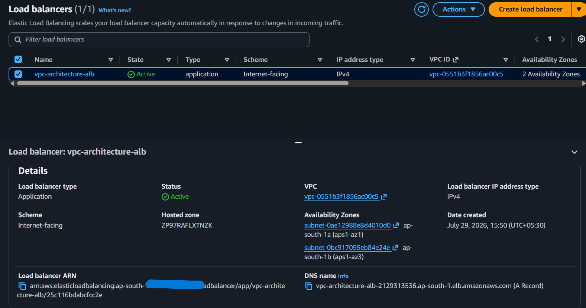
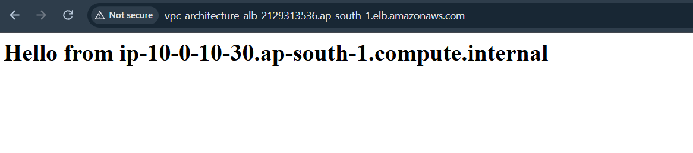
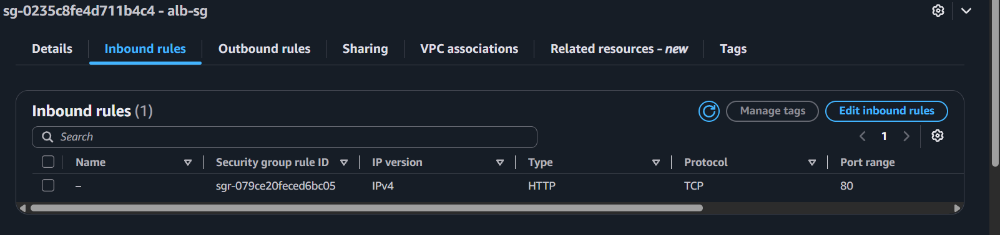

# Milestone 4: Application Load Balancer

**Why:** With EC2 instances running in private subnets and inaccessible from the internet, this milestone adds the Application Load Balancer — the internet-facing component that receives inbound HTTP traffic and distributes it across healthy instances via a target group, spanning both public subnets for redundancy.

**What was built:**
- Target group `vpc-architecture-tg` — HTTP:80, health check path `/`, registered the EC2 instance from the ASG
- Application Load Balancer `vpc-architecture-alb` — internet-facing, spans `public-subnet-1` and `public-subnet-2`, `alb-sg` attached, HTTP:80 listener forwarding to `vpc-architecture-tg`
- Attached the ASG (`vpc-architecture-asg`) to the target group, so any future scaling stays automatically load-balanced

**Lessons Learned**
- The ALB's health check and the ASG's health check serve different purposes: the ALB's health check determines whether traffic is routed to an instance, while the ASG's health check determines whether an unhealthy instance is terminated and replaced. By default, the ASG only checks EC2-level health (is the instance running), not application-level health (is the app actually responding) — that requires explicitly enabling ELB health checks on the ASG.
- AWS enforces a minimum 2-AZ requirement when creating an ALB — you cannot create one with only a single subnet/AZ selected, so this redundancy isn't something you can accidentally skip.
- Typing `https://` instead of `http://` against an ALB with only an HTTP listener configured causes a browser connection failure ("site can't be reached"), not an ALB-level error — worth checking the URL scheme explicitly before assuming the infrastructure is broken.

**Screenshots**

