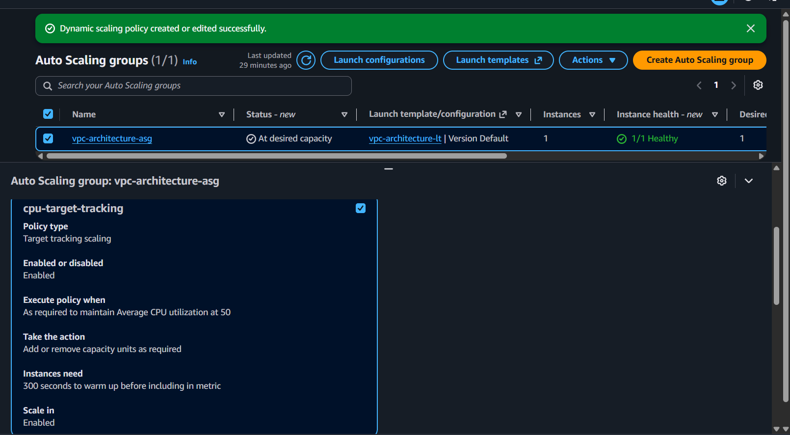
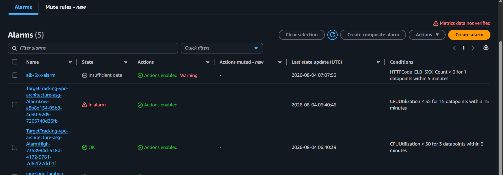
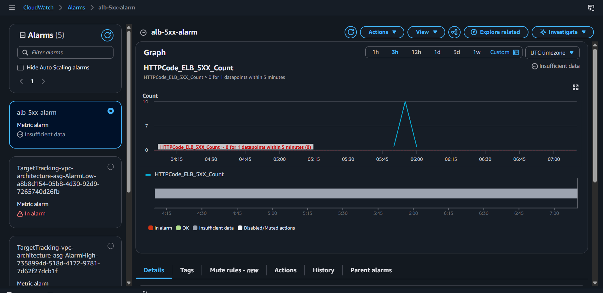
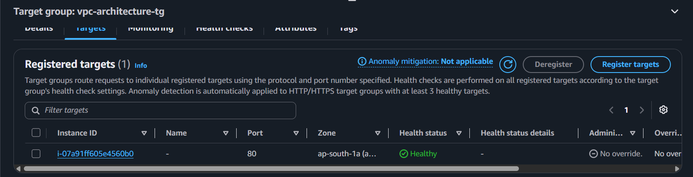

# Milestone 5: Auto Scaling Policies + CloudWatch Monitoring

**Why:** Up to this point, the ASG's capacity was being set manually — a fixed number that might be insufficient during real traffic or wasteful when idle. A target tracking scaling policy lets the ASG adjust capacity automatically based on actual CPU load. Alongside this, CloudWatch alarms are needed so that failures (like ALB errors) are surfaced immediately rather than only discovered by manually checking.

**What was built:**
- Target tracking scaling policy `cpu-target-tracking` on the ASG — target: 50% average CPU utilization
- CloudWatch alarm `alb-5xx-alarm` — on `HTTPCode_ELB_5XX_Count`, threshold greater than 0, notifies via SNS on any ALB-level 5xx error
- (Auto-created by the scaling policy) `AlarmHigh` and `AlarmLow` — trigger scale-out when CPU is above target, and signal scale-in eligibility when CPU is below target

**Lessons Learned**
- Creating a target tracking scaling policy automatically creates its own CloudWatch alarms (AlarmHigh/AlarmLow) behind the scenes — seeing one of these in an "In alarm" state doesn't necessarily mean something is broken; it can simply reflect an idle instance below the target threshold, with the ASG's minimum capacity acting as a floor preventing any real scale-in.
- CloudWatch's metric browser only surfaces metrics that already have at least one real data point — a metric like `HTTPCode_ELB_5XX_Count` won't appear in the browse tree until an actual 5xx has occurred, even though the alarm can still be created on it directly.

**Screenshots**

