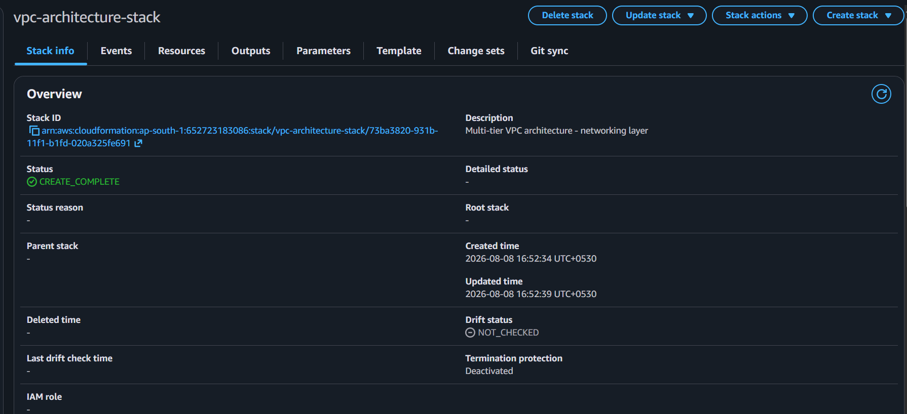
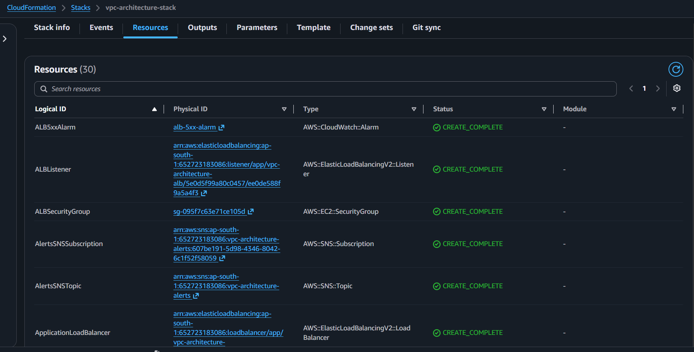

# Milestone 6: CloudFormation Rewrite (Infrastructure as Code)

**Why:** Manually creating and tearing down the environment through the console is risky — forgetting to create a resource leaves the environment broken, and forgetting to delete one leads to unnecessary charges, both of which happened during this project. Rewriting the architecture as Infrastructure as Code removes this risk: one command creates every resource in the correct order, and one command tears it all down completely.

**What was built:**
- `infrastructure/template.yaml` — defines all ~15+ resources (VPC, subnets, IGW, route tables, NAT Gateway, security groups, IAM role, launch template, ASG, target group, ALB, scaling policy, CloudWatch alarms, SNS topic)
- Deployed via `aws cloudformation deploy` to stack `vpc-architecture-stack`
- Verified end-to-end: ALB DNS name serves the test page, SNS email subscription confirmed

**Lessons Learned**
- Before deploying via CloudFormation, any resources created manually with the same names in earlier milestones must be deleted first — CloudFormation validates for name conflicts across the account/region before creating anything, and refuses to proceed if a same-named resource already exists (this specifically caused two failed deploy attempts, from a leftover SNS topic and CloudWatch alarm).
- Resources referencing each other via `!Ref` inside the same template (like the ASG pointing at the target group) always resolve to whatever currently exists in that stack — unlike manually copying an ID between console screens, there's no way for the reference to go stale, which is exactly what caused the Milestone 4 outage.

**Screenshots**

