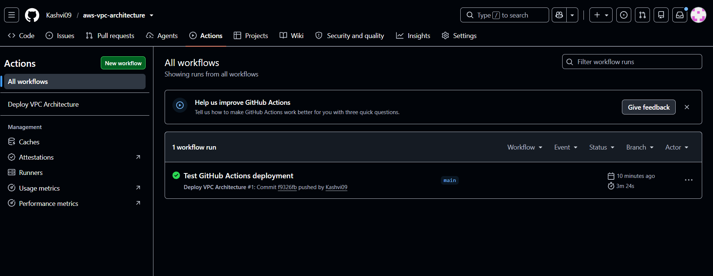
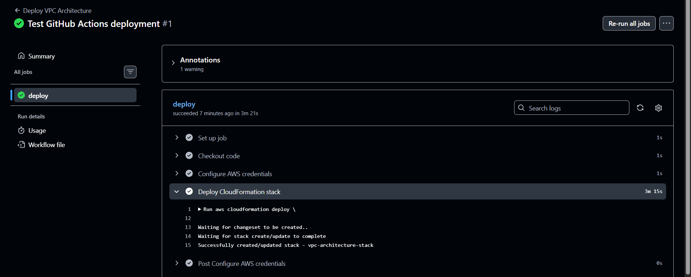
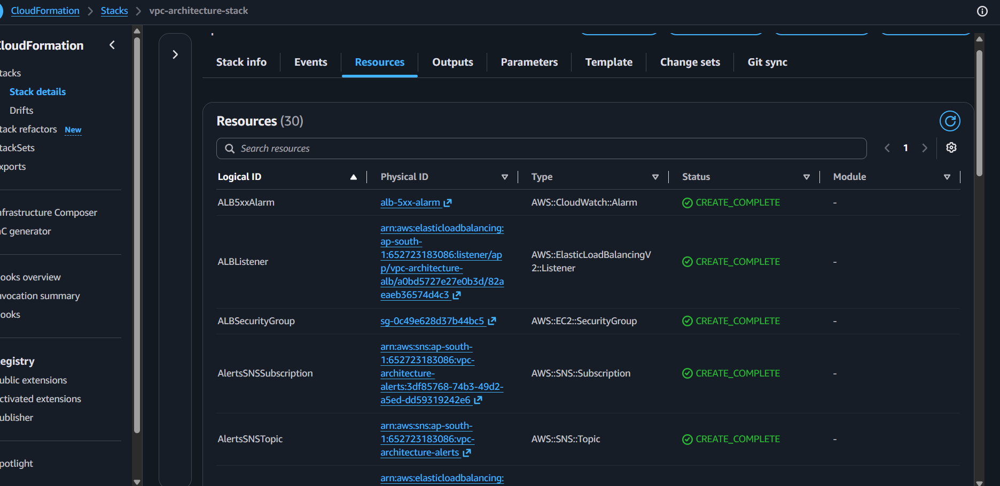
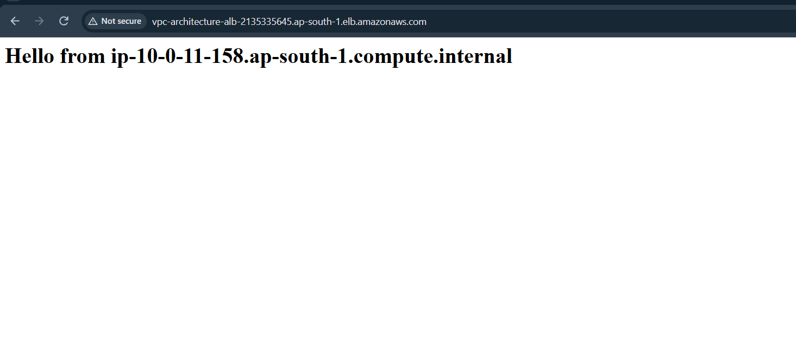

# Milestone 7: CI/CD via GitHub Actions

**Why:** Deploying manually meant running `aws cloudformation deploy` locally, using personal AWS credentials — this doesn't scale as a practice and leaves no automated record of when or why a deploy happened. GitHub Actions automates this: pushing a change to `template.yaml` on `main` triggers a deployment automatically, using a dedicated, scoped IAM identity rather than personal credentials, mirroring the CI/CD pattern already proven in Project 1.

**What was built:**
- IAM user `github-actions-deployer-vpc` — created separately from Project 1's deployer to isolate blast radius between projects, with managed policies covering EC2, SNS, Auto Scaling, CloudFormation, CloudWatch, ELB, and IAM
- GitHub encrypted secrets (`AWS_ACCESS_KEY_ID`, `AWS_SECRET_ACCESS_KEY`) configured in the repo
- `.github/workflows/deploy.yml` — triggers on push to `main`, scoped to changes in `infrastructure/template.yaml` only, runs `aws cloudformation deploy` against `vpc-architecture-stack`

**Lessons Learned**
- Scoping the workflow trigger to `paths: infrastructure/template.yaml` prevents unrelated changes (like README or documentation edits) from triggering a full deployment attempt — deployments should only run when the actual infrastructure changes.
- GitHub encrypted secrets are never retrievable by viewing a repo, even a public one — the real risk with storing static AWS access keys as secrets is exfiltration through misconfigured workflows (e.g., running untrusted pull requests) or accidental leaks elsewhere, since the keys are long-lived until manually rotated. OIDC federation, which issues short-lived credentials scoped to a single workflow run instead of storing static keys, is a more secure alternative worth adopting in a future iteration.

**Screenshots**

