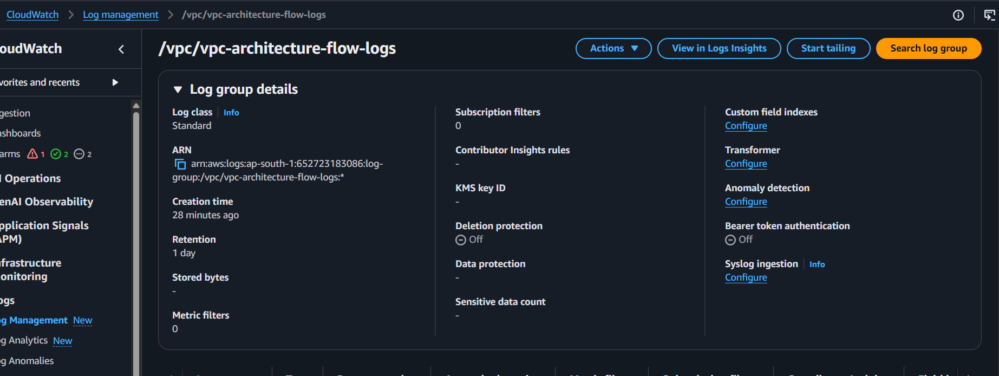
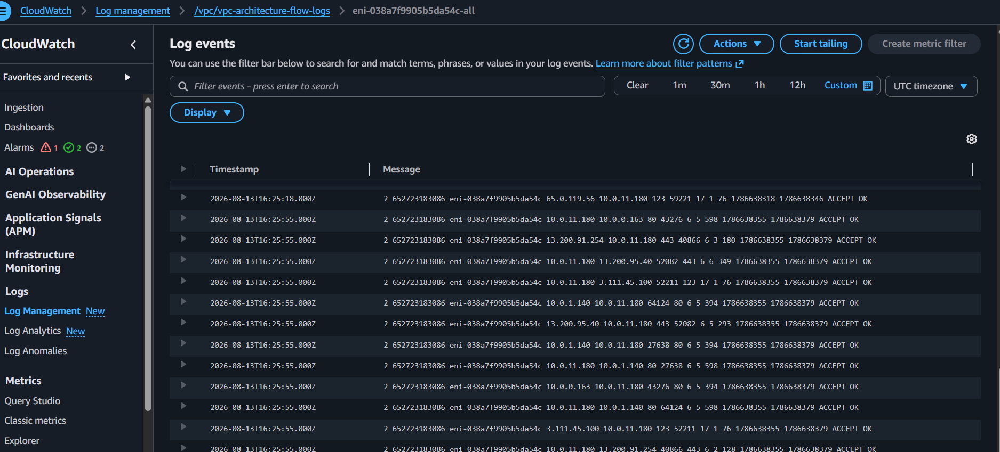
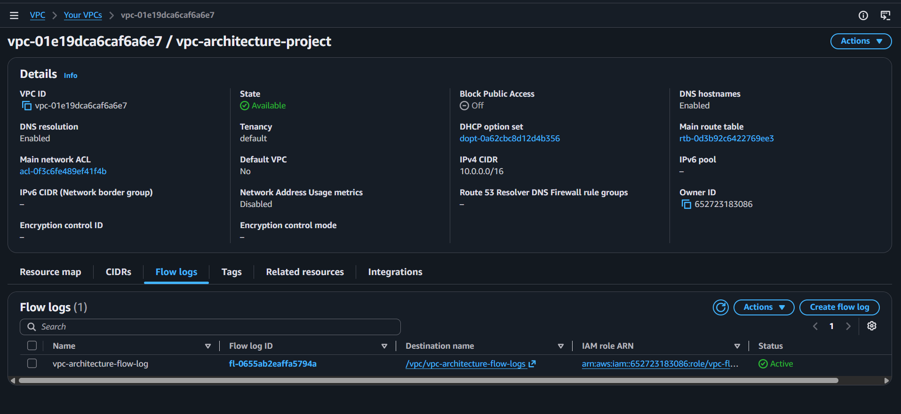
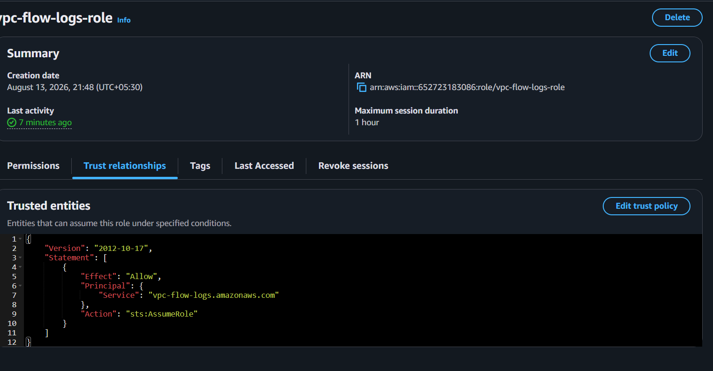

# Milestone 8: VPC Flow Logs

**Why:** The VPC had no network-level audit trail — no record of what traffic actually flowed through the network, what was accepted, or what was rejected. VPC Flow Logs capture this metadata and send it to CloudWatch Logs, giving visibility into network activity that's directly relevant to security auditing and compliance, both core concerns in the cybersecurity + cloud intersection this portfolio targets.

**What was built:**
- CloudWatch Log Group `/vpc/vpc-architecture-flow-logs`, 1-day retention (cost control)
- IAM role `vpc-flow-logs-role`, trusted by the VPC Flow Logs service, with a custom inline policy scoped to only the specific log group's ARN (rather than a broad managed policy)
- Flow Log `vpc-architecture-flow-log`, scoped to the whole VPC, capturing ALL traffic (both ACCEPT and REJECT), destination: CloudWatch Logs
- Verified by generating real traffic through the ALB and confirming captured log entries (source/destination IP, port, protocol, action)
- Folded into `infrastructure/template.yaml` as its own section, so Flow Logs now deploys and tears down as part of the single CloudFormation stack, rather than being a separate manual step

**Lessons Learned**
- Logging ALL traffic (not just REJECT) matters because accepted traffic is just as important a security signal as rejected traffic — e.g., confirming that only expected, legitimate connections were accepted is as valuable as seeing what was blocked.
- Writing the Flow Logs IAM role directly in CloudFormation, rather than through the console, made it natural to scope permissions tightly (an inline policy limited to this exact log group's ARN) instead of reaching for a broad managed policy like `CloudWatchLogsFullAccess` — IaC makes least-privilege the easier default, not an extra step.
- A feature built manually outside the CloudFormation template becomes a hidden gap in the "one command rebuilds everything" story — folding Flow Logs into the template immediately, rather than leaving it as a recurring manual step, keeps the whole architecture consistently reproducible.

**Screenshots**

